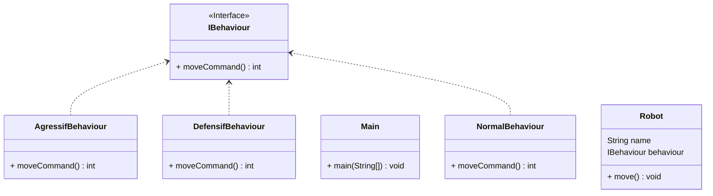

```mermaid
classDiagram
direction BT
class AgressifBehaviour {
  + moveCommand() int
}
class DefensifBehaviour {
  + moveCommand() int
}
class IBehaviour {
<<Interface>>
  + moveCommand() int
}
class Main {
  + main(String[]) void
}
class NormalBehaviour {
  + moveCommand() int
}
class Robot {
  + move() void
   String name
   IBehaviour behaviour
}

AgressifBehaviour  ..>  IBehaviour 
DefensifBehaviour  ..>  IBehaviour 
NormalBehaviour  ..>  IBehaviour 
```