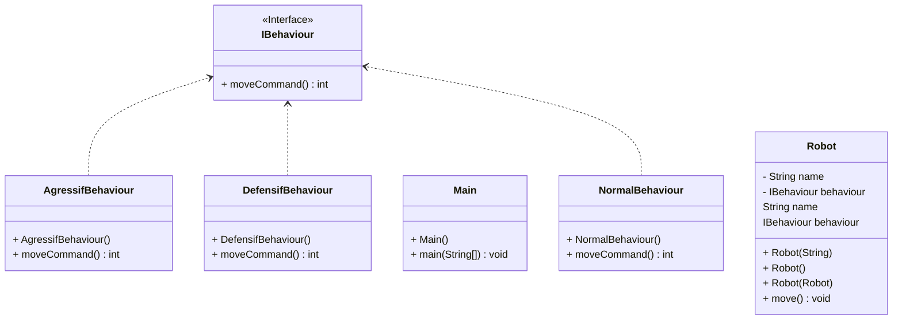

```mermaid
classDiagram
direction BT
class AgressifBehaviour {
  + AgressifBehaviour() 
  + moveCommand() int
}
class DefensifBehaviour {
  + DefensifBehaviour() 
  + moveCommand() int
}
class IBehaviour {
<<Interface>>
  + moveCommand() int
}
class Main {
  + Main() 
  + main(String[]) void
}
class NormalBehaviour {
  + NormalBehaviour() 
  + moveCommand() int
}
class Robot {
  + Robot(String) 
  + Robot() 
  + Robot(Robot) 
  - String name
  - IBehaviour behaviour
  + move() void
   String name
   IBehaviour behaviour
}

AgressifBehaviour  ..>  IBehaviour 
DefensifBehaviour  ..>  IBehaviour 
NormalBehaviour  ..>  IBehaviour 
```
